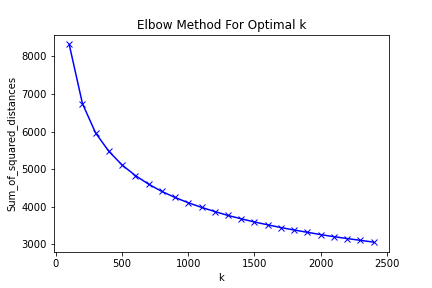

##   Georgia Tech Bootcamp Final Project - Song Finder 

This is the Final Project for our Data Analytics Bootcamp

Original Data from: https://www.kaggle.com/yamaerenay/spotify-dataset-19212020-160k-tracks?select=data.csv

#### Overview

The SongFinder is a Heroku hosted site designed to allow the user to select an artist and song to recive a list of musically similar songs

Machine Learning kMeans Clustering was used to group almost 100K songs into clusters. The cluster-id assigned in the kMeans clustering became the queried field to find and return songs to the user

The site can be accessed at: https://songfinder-finalproject.herokuapp.com/

#### Software Used

 - Jupyter notebook - Python:
    - Pandas
    - SciKit - kMeans
    - SQLAlchemy
    - Matplotlib
    
 - Flask w/SQLALchemy
 - Postgres
 - Javascript, D3
 - HTML w/Bootstrap, CSS
 
 

#### Machine Learning 

Machine Learning is a hot topic in business today. Businesses want to predict customer wants and curate to their needs to make the buying process better for both.
This project uses kMeans clustering Machine Learning to power a web-app. This web-app provides the user with a song list to explore based on musical characteristics of a song they choose.

The following  paragraphs highlight this process in the context of machine learning with Spotify music data

#####   `How Spotify Learns vs kMeans Model
How Spotify Learns vs kMeans Model
  
  |Model|Supervised?|Audio Characteristics|User Input|NLP|Summary|
|:-----|:----:|----:|----:|----:|----:|
|Spotify |Yes |Yes |Yes |Yes |Multiple inputs, individualized
|SongFinder|No |Yes |No |No|kMeans Clustering by Music characteristics, generalized

## All of these are used by Spotify. SongFinder uses Spotify Raw Audio Analyzation data.

##### Natural Language Processing
Analyses the language, lyrics and content of a song.

##### Raw Audio Analyzation
Detects the “vibe” or “mood” of a song’s audio and decides whether it’s upbeat, chill, heavy, minimal, instrumental etc... 

##### Collaborative Filtering
Compares new songs to a listener’s current habits to decide what will suit their tastes.

### Machine Learning Steps

1. Spotify data sourced from Kaggle and added to Postgres 
2. SQLAlchemy used to extract data into jupyter notebook/pandas dataframe
3. Scaled feature values to 0-1

 |Measurement|popularity|year|key|loudness dB|tempo|
|:-----|:----:|----:|----:|----:|----:|
|Original Scale|0-100 |1920-2021 |0-11 |-60 - 3.855 |0 - 243.507|
|Scaling Applied|/1000 |/2021/10 |/11 |/60 |/244 |
|Notes |Reduced to prevent overindexing |Reduced to prevent overindexing|Scaled to fit into 0-1|Scaled to fit into 0-1|Scaled to fit into 0-1|

4. Perform K means to establish clusters
5. Use Elbow method to evaluate cluster size

  
  
  K - Clusters Produce Y Inertia  
  
  Optimal Cluster Number Is At The Elbow: Where Distortion/Inertia Start Decreasing In A Linear Fashion.

7. Validate recommendations vs cluster size via human sampling

The Elbow method would have produced cluster sizes as large as 250 songs

The chosen model clusters were half the size resulting in better song recommendations

8. Run K means with chosen cluster size
9. Upload data for song recommendation platform

